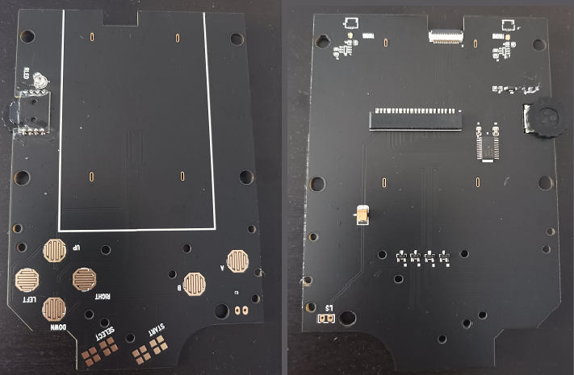
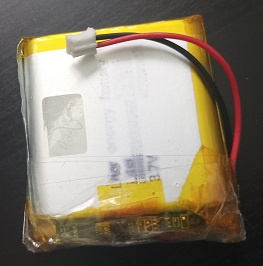

# FAQs

## What IPS boards are compatible with the VIS front IPS PCB?

My front PCB can be used to replace the following IPS board used in the v4 and v5 OSD IPS.

## What speaker can be used?

You can use the original Gameboy speaker or 1 Watt 8 Ohm speaker (23 mm diameter) like the following one (**it must have + and - soldering points**)

## Can the gain of the speaker be controlled?

Yes, on the mainboard, I use **R53=R56=10 kΩ for the original speaker** and **R53=R56=30 kΩ for the 1W speaker**. Hence, by increasing the value of R53 and R56, audio power increases; otherwise, it decreases.

## How much power does the power board provide?

DC voltage or battery voltage is firstly regulated to 5V and then it is filtered with an ultra-low noise LDO (U4 on the power board) that provides in output a 5V line with 300 mA. This power is sufficient for all the features. In addition the U5 LDO provides the 3.3v line for the RGB LEDs.

## Has the Lipo power board all the protections?

I put all the know protections for the battery so it won't overcharge, discharge, or have a short circuit. To do this, I used well know schematics and chip combinations to develop the Lipo board.

## What is the Lipo Battery to use?

I suggest any 3.7V 125054 Lipo battery with a ph2.0 connector installed, as shown in the following image.

## Has mainboard protection?

Yes, there are resettable fuses in series to the battery and the DC lineD. In addition, also the boost converter and the LDO limit the current on the various lines.

