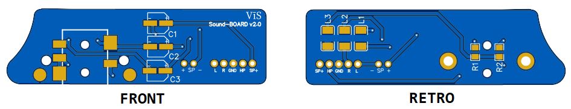

# Production information

Gerber files are located inside ProductionFiles in which you can find 1 PCB in each file or more than 1 PCB into a single file as breakable boards. 
I suggest ENIG surface finish for easier soldering job and longer PCB shelf life.

## Mainboard PCB (4 layers PCB)

Produce the mainboard PCB with 1 mm or 1.2 mm thickness.

## Audio PCB (2 layers PCB)

Produce the audio PCB with 1 mm or 1.2 mm thickness. 

## Audio Jack raiser (2 layers PCB)

Produce Audio Jack raiser PCB with 1.6 mm thickness. If producer contact you by telling that PCB can break you answer to accept this risk and move on the production.

## IPS front PCB (4 layers PCB)

Produce the IPS front PCB with 1 mm or 1.2 mm thickness (I suggest ENIG surface finish for better buttons feeling). 

## OSD v5 IPS LCD bracket PCB (2 layers PCB)

Produce the OSD v5 IPS LCD bracket PCB with 1 mm or less thickness (I produced mine with 1 mm but then there is the need to shorten by sanding or by using a dremel the welding terminals). 

## IPS wheele PCB (2 layers PCB)

Produce the IPS wheele PCB with 1 mm or 1.2 mm thickness. 

## Audio connector PCB (2 layers PCB)

Produce the Audio connector PCB with 1 mm or less thickness.

