# VIS Game Boy DMG 2.0

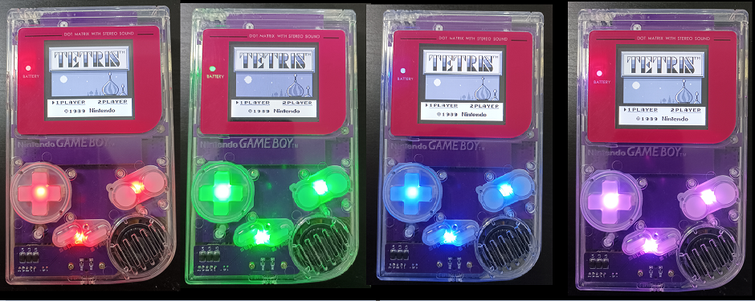

This project was born with the aim of saving corroded boards of **Gameboy DMGs** or **SNES Super Gameboy adapter**s. For this reason, I developed replacement PCBs by using modern electronic components. Essentially this is a gameboy DMG having:
- a built-in lipo power board with charger
- analog power and button RGB LEDs
- tactile switches
- this version only support IPS screens and not the original screen with the original front PCB (see the v1 version if you want to keep the original front PCB)
- 1 watt audio speaker support
- a cool design in which the front view of the console is totally covered by the PCBs 
- mainboard and IPS board are 4-layer PCBs in which analog and digital lines are kept separated in order to minimize audio noise (separated analog/digital/power ground are kept in this version. They are connected only into a single point). Clearly audio noise cannot be completely removed since the CPU accept only an unique 5v line (without a separated analog input for the audio). Anyway, the low audio noise in this version probably is the cleaner audio you can have by using a lipo battery and the high volume provided by 1 watt speaker.
See the begininng of the youtube video [DMG v2](https://youtu.be/zv3Ng8fEEQI) to see it in action.

## Disclaimer

**This is a DIY project for electronic enthusiasts. For this reason, I am not responsible for any damage incurred while attempting this project or after completion of the project. You alone accept all risk since you are 100% liable for damage to yourself or your property.**

## Required Donor parts

In this project, the **strictly required donor parts** are only 
  - the **CPU** (that can be sourced from a donor DMG mainboard or a SNES super Gameboy adapter).
  - the **link-port** (that can be sourced from a donor DMG mainboard or from a 4-player adapter DMG-07).

Other **optional components to desolder** from a donor console are:
  - **RAM** chips (can be sourced from a donor DMG mainboard or a SNES super Gameboy adapter) or the Alliance AS6C6264-55SIN RAM chips can be purchased.
  - **Card slot connector, volume wheel, and quartz oscillator** can be sourced from a donor DMG mainboard or can be simply purchased on Aliexpress.
  - **Power switch** can be sourced from a donor DMG mainboard, or a brand new switch can be purchased at any electronic components shop (see BOM file).

## Required Parts to purchase or reuse

  - **All the electronic components** reported in the BOM file.
  - **Housing DMG shell case** (optional if you already have one).
  - **IPS LCD kit** If you want to use the VIS front PCB, you have to buy the v4 or v5 OSD version (see the FAQs [here](FAQs.md) for more details). You can find (in the files of this project) the 3D model of the LCD bracket (IPS v5). You can simply 3D print it (I suggest transparent), and then you can prepare it with sandpaper and paint it with the color you need. This model of the bracket fully masks the entire LCD (it is useful if you use a transparent shell). Alternatively, you can produce the bracket PCB and use it. See the youtube video for more details.
  - **3.7V 125054 Lipo battery** (optional if you want to use only the DC jack)  (see the FAQs [here](FAQs.md) for more details).
  - **Kitsch-Bent full silicone buttons** (optional).
  - **1 Watt speaker** (optional if you want to use the original DMG speaker).  You can find (in the files of this project) the 3D model of the holder that you can use to take it in place without glue it to the housing shell (the holder fit the Retrosix 23 mm 1 watt speaker). If you buy 1 watt speaker please buy an high quality speaker from Retrosix (those that I use) or Handheldlegend avoiding cheap speakers.
  - **wires and ph2.0 housing connectors** (optional) reported in the last sections of the BOM file.
  - **PH2.0 2.0mm Metal Crimp Pin Terminal Wire Cable for Housing PH 2.0 Female Socket Connector** (optional) that can be purchased here [Link Aliexpress](https://www.aliexpress.com/item/1005004266276874.html).
  - **5v 2A USB-C charger with the 2A cable USB adapter** (I suggest the right angle version) that can be purchased here [Link Aliexpress](https://www.aliexpress.com/item/4000285082506.html).
  - If you decide to use the **audio connector PCB** you can buy the 2.0 mm pitch headers from here [Link Aliexpress](https://www.aliexpress.com/item/4000694199194.html).
  - I suggest to use **full silicone buttons from Kitsch-Bent** as shown in this [short video](https://www.youtube.com/watch?v=DBGJTIemyE4&t=64s&ab_channel=V1sModding).
  - **Acrylic bars for the power LED (3mm)** can be purchased here [Link Aliexpress](https://www.aliexpress.com/item/1005005626315979.html).
  - **flat connectors 21 pin pitch 1.25mm** if you don't find them you can simply buy the 22 pin version (clearly also a 22 pin cable) and use them by leaving unsoldered one pin on both the mainboard and the IPS board (in doing this you have to leave unsoldered the first pin on a board and the last pin of the other one).

## Boards compatibility

  - Audio board is not compatible with exisisting gameboy boards. Since in this version audio amplifier is on the mainboard the audio board is not compatible also with my previous gameboy. Also the new audio taller is not compatible with the previous gameboy version. In few words, don't mix production files of this realease with those of the previous gameboy release.
  - Other IPS boards can be used with this realese but the following jumpers must be left open. In any case the speaker must be always connected to the audio PCB and not on the IPS PCB.

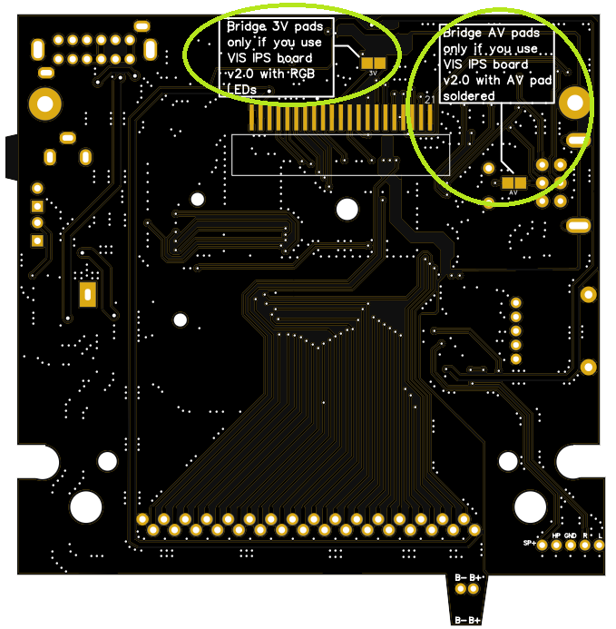

## How produce the PCBs

link [here](PCB_info.md).

## Instructions

Start by soldering firstly the U3 boost Ic and check solder continuity/no bridges by using the zoom in the following image. Then, populate all the power board and test the 3.3v and 5v lines (see the image) and also test the charging circuit as explained in the [setup video DMG v1](https://youtu.be/e4qCekoWYW4) of previous DMG version. Note that, for the charger, you can use in this version the SMD LEDs (green and red) or the 3mm LEDs (they are usefull if you don't use a tranpsarent shell. Hence you can make 2 holes and put properly the LEDs in order to see lights when charging).
**you must supply to the DC JACK 5v!!!** 

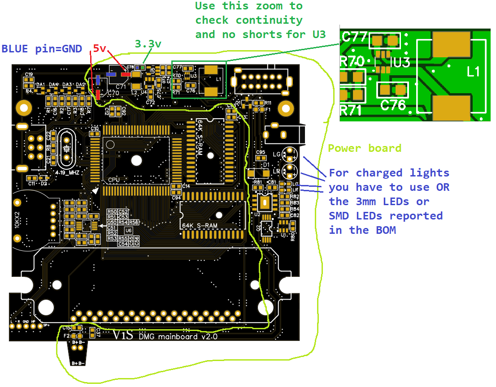

**IMPORTANT FIX for mainboard v2.0 (this fix, to lower the noise, will be added in coming soon new 2 layers version)** Solder a 220 pF capacitor in parallel R70 as shown in the following image. This capacitor improves the loop stability of the boost U3 and practically you will have extremely low noise. In addition, add 220uF cap as shown in the image. I ensure you that you never heard a so silent Gameboy.

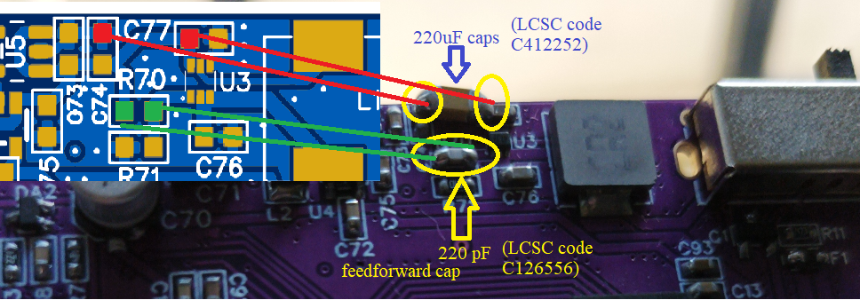

When you are sure on the power board installation you can proceed to populate all the boards. See in this case also the [setup video DMG v1](https://youtu.be/e4qCekoWYW4) to understand how solder the IPS wheele and the audio taller.

I remember you that all the tactile switches must be soldered with the orientation shown in the following old image.

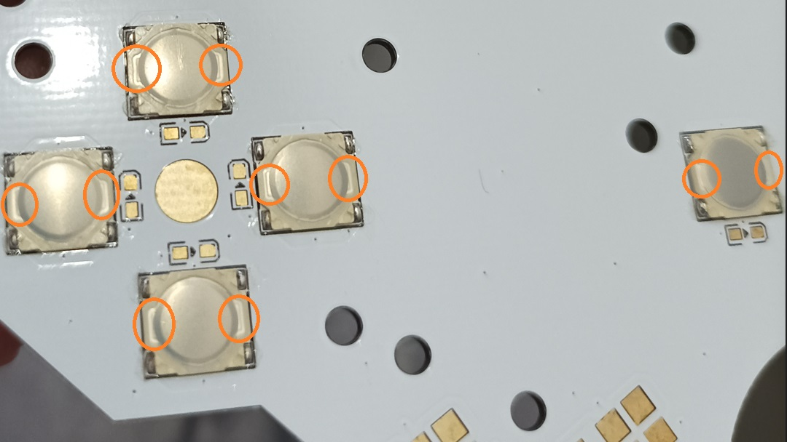

The reverse mounting RGB LEDs orientation is the following.

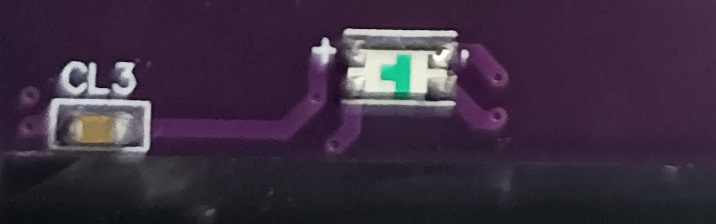

When mounting the IPS PCB into the shell keep in mind the suggestions shown in the following image.

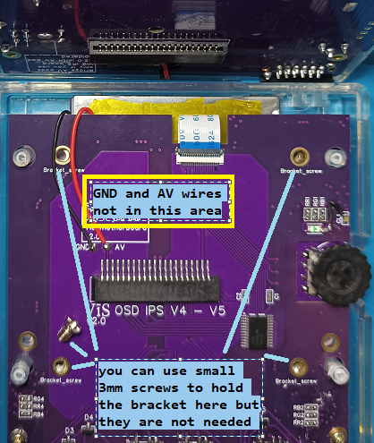

To regulate the contrast wheel position please referr to the following image.

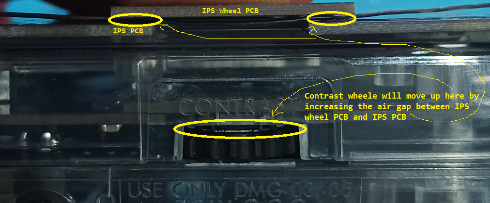

Since I use the PCB LCD bracket, I installed mine as shown in the following image. 

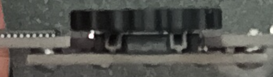

To avoid pressure on DPAD RGB LED please trim the shell as explained in the following image.

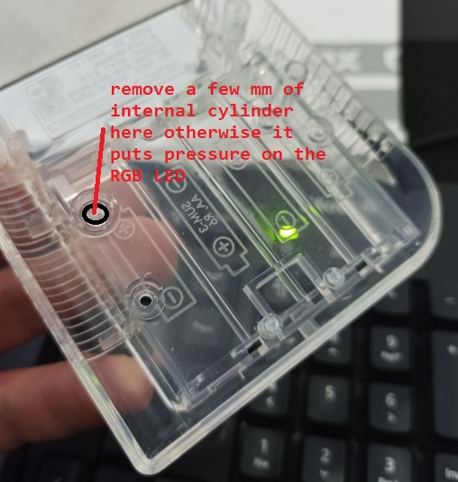

If the audio connector is used I suggest to cut the speaker holder in the following way.

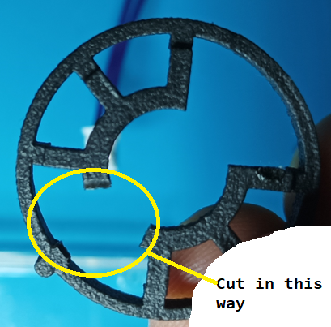

Finally, consider also the following suggestion.

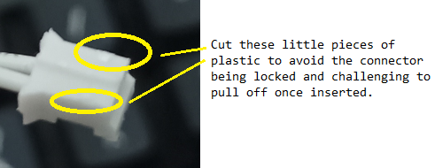

See the youtube video [DMG v2](https://youtu.be/zv3Ng8fEEQI) for additional instructions.

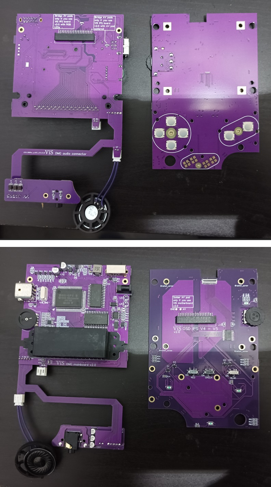

**PCB audio connector instructions have been added on the updated youtube video**

**WARNING** Don't do a bath of 15/30 minutes for the IPS board if tactiles are installed (keep them outside the IPA; otherwise, the glue that keep metal pieces will be dissolved and switches break). I solder the tactiles after the bath in IPA without using additional flux (I simply exploit the flux of the soldering tin).

**NOTE**: When you start to hear aliens coming from the speaker and the screen starts flashing, it means that you have to charge the battery. I have not disabled the CPU in this case to give you the time to attach the power supply without loosing the game in progress!!!

## RGB LEDs brightness

You can regulate the brightness of the RGB LEDs by changing the resistors value. I put in the BOM the value that I use but you can change them. 
The LEDs are in parallel so a burned LED will not affect the others. The schematic is very simple and it is the following

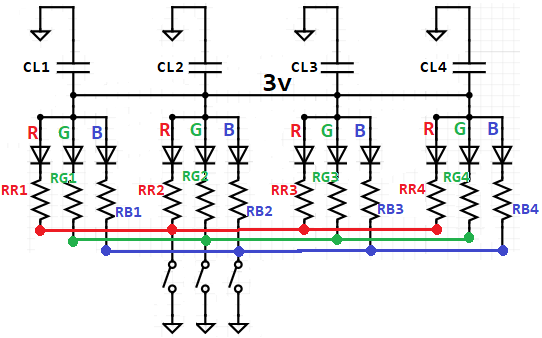

## RGB LEDs color

By using the 3 switches (one for RED, one for BLUE and one for GREEN) you can choose between 8 different colors. The combinations are the following.

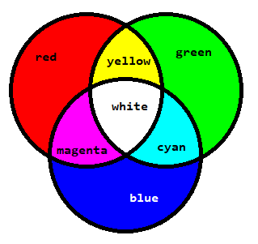

## Credits

  - [Bucket Mouse](https://github.com/MouseBiteLabs/) for the [DMGC](https://github.com/MouseBiteLabs/Game-Boy-DMG-Color) project from which I get the RGB LEDs idea, the correct position of some holes, the audio amplifier location and the tactile buttons model

  - [consolesandcasks or Deceptive thinker](https://github.com/consolesandcasks) for another [Heavy CPU MGB](https://github.com/ConsolesandCasks/CPU-MGB-Heavy) project that I referenced and utilized to update the actual DC Jack

  - [Kamicane](https://github.com/kamicane/) for the [Super DMG](https://github.com/kamicane/Super-DMG-01) project from wich I get the audio board shape

  - [Gekkio](https://github.com/Gekkio/) for the [DMG](https://github.com/Gekkio/gb-schematics/tree/main/DMG-CPU-06) schematics

## FAQs

link [here](FAQs.md).

## Troubleshooting

link [here](troubleshooting.md).

## Acknowledgements

I would like to thank Mathijs (the creator of SYF Game Gear PCBs) for his several suggestions, schematics, and help in this project. I would like to thank also Luke from Retrosix for some usefull suggestions.

## License
 This work is licensed under a <a rel="license" href="http://creativecommons.org/licenses/by-sa/4.0/">Creative Commons Attribution-ShareAlike 4.0 International License</a>. You are able to copy and redistribute the material in any medium or format, as well as remix, transform, or build upon the material for any purpose (even commercial) - but you **must** give appropriate credit, provide a link to the license, and indicate if any changes were made.

## Support VIS projects

I have several stuffs in mind, but since developing these things has a high cost in materials and prototypes, a little [PayPal](https://www.paypal.com/donate/?hosted_button_id=64CARRQYFEZYL) donation is appreciated.

## Contacts

**email**: vis.modding@gmail.com  

**discord**: you can find me as *vis_modding* on several servers (BennVenn, Mouse Bit Lab, Retrosix modding, Game Boy, Gameboy makers).
